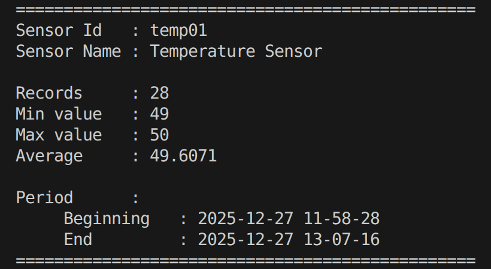
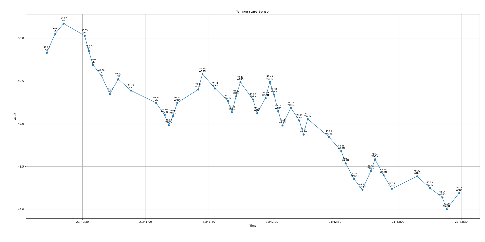
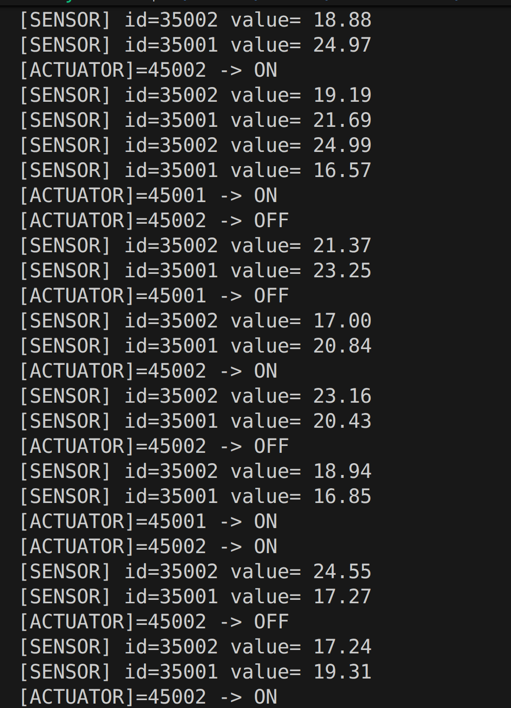

🏠 Home-SCADA (C++17)

Home-SCADA — это учебная модульная SCADA-платформа на C++17, предназначенная для моделирования работы умного дома: датчики, исполнительные устройства, обработка данных и последующее расширение до полнофункциональной SCADA-системы.

На текущем этапе проект формирует фундамент: конфигурации устройств, базовые классы данных и минимальная логика управления.

## Archive Report (console)

Example of console archive summary generated by `ArchiveReport`:

## Пример отчёта архива

Скриншот демонстрирует пример сформированного отчёта архива на основе сохранённых данных сенсора.
Отчёт генерируется классом `ArchiveReport` и содержит базовую статистику
(минимум / максимум / среднее / период).

Сбор и хранение данных выполняется ядром на C++,
визуализация выполняется внешними инструментами.

