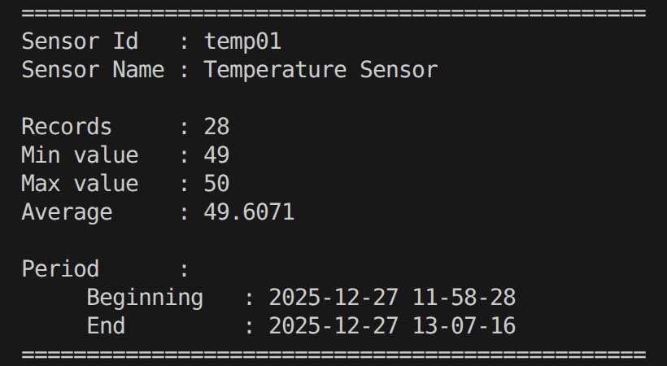
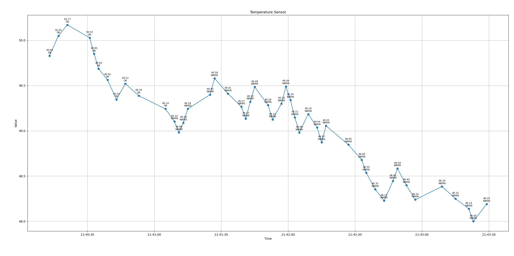

🏠 Home-SCADA (C++17)

Home-SCADA — это модульная SCADA-платформа на C++17, предназначенная для моделирования работы умного дома: датчики, исполнительные устройства, обработка данных и последующее расширение до полнофункциональной SCADA-системы.

На текущем этапе проект формирует фундамент: конфигурации устройств, базовые классы данных и минимальная логика управления.

## Archive Report (console)

Example of console archive summary generated by `ArchiveReport`:



## Пример отчёта архива

Скриншот демонстрирует пример сформированного отчёта архива на основе сохранённых данных сенсора.
Отчёт генерируется классом `ArchiveReport` и содержит базовую статистику
(минимум / максимум / среднее / период).

Сбор и хранение данных выполняется ядром на C++,
визуализация выполняется внешними инструментами.



## Пример работы ядра Home-SCADA
 
Поток значений с датчиков и автоматическое переключение актуаторов (ON/OFF) по заданным правилам.


## Запуск тестового Modbus сервера*

1. **Установка libmodbus**
   ```bash
   sudo apt install -y libmodbus-dev

2. **Установка**:
   ```bash
   cd modbusServer
   python3 -m venv venv
   source venv/bin/activate
   pip install pymodbus
    

3. **Запуск**:
    ```bash
    cd modbusServer
    source venv/bin/activate
    python3 modbus_server.py


