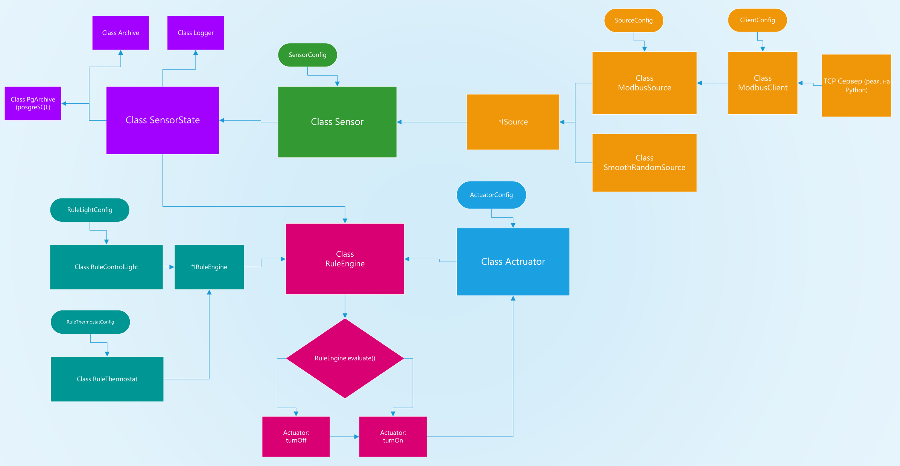

🏠 Home-SCADA (C++17)

Home-SCADA — это модульная SCADA-платформа на C++17, предназначенная для моделирования работы умного дома: датчики, исполнительные устройства, обработка данных и последующее расширение до полнофункциональной SCADA-системы.

## Пример работы ядра Home-SCADA
 
Поток значений с датчиков и автоматическое переключение актуаторов (ON/OFF) по заданным правилам.


## Архитектурная схема ядра Home-SCADA

Ниже представлена высокоуровневая схема текущей архитектуры ядра проекта Home-SCADA.




## Vertical slice управления split-system (1 этаж)

Реализован рабочий вертикальный срез управления сплит-системами 1-го этажа на основе новой архитектуры актуаторов.

Что сделано:

Введён интерфейс IActuator как единый контракт для работы с актуаторами
Добавлен GenericActuator — универсальный актуатор, не зависящий от конкретного транспорта
Реализована абстракция ITransport для доставки команд
Добавлен ModbusTransport для записи команд через ModbusClient
Обновлён CompositionRoot: инициализация клиентов, transport-слоя и актуаторов через dependency wiring
Обновлены RuleEngine и правила для работы с интерфейсными актуаторами
Скорректированы JSON-конфиги для тестирования вертикального среза 1-го этажа
Реализован полный контур управления: чтение → применение правил → запись команды

Результат:

Система теперь:
считывает значения температурных датчиков из настроенных источников
применяет логику в соответствии с конфигурацией
управляет сплит-системами 1-го этажа через запись в Modbus
выполняет полный цикл управления в соответствии с правилами и уставками из конфигов

## 1st floor plan


## Запуск тестового Modbus сервера*

1. **Установка libmodbus**
   ```bash
   sudo apt install -y libmodbus-dev

2. **Установка**:
   ```bash
   cd modbusServer
   python3 -m venv venv
   source venv/bin/activate
   pip install pymodbus
    

3. **Запуск**:
    ```bash
    cd modbusServer
    source venv/bin/activate
    python3 split_sim_server.py


